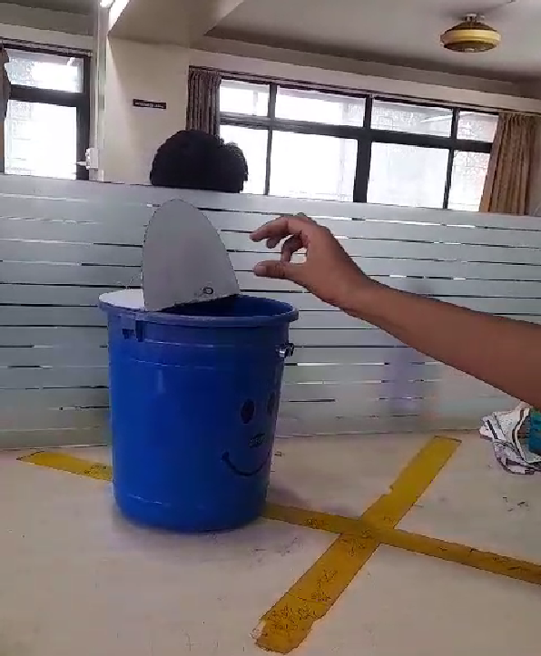
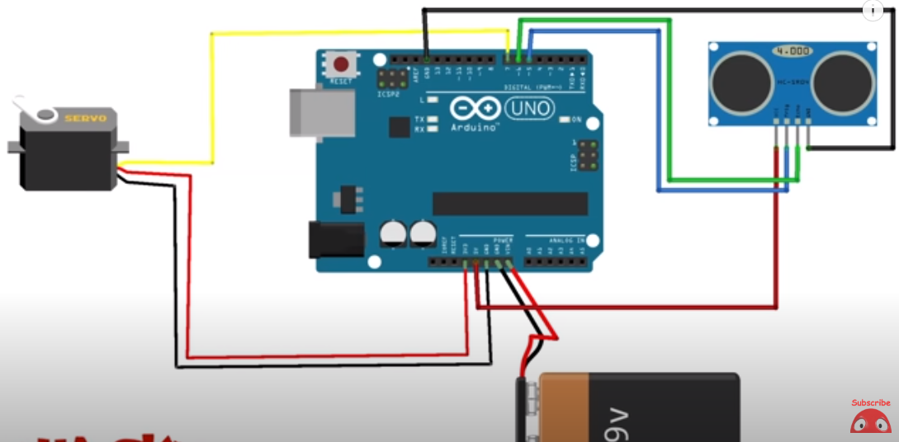

<br/>
<p align="center">

  <h3 align="center">SmartDustbin</h3>

  <p align="center">
A smart dustbin project using Arduino to sense motion and open only when motion is detected, closing automatically after waste disposal.
    <br/>
    <br/>
    <a href="https://github.com/itsskofficial/Arduino/Projects/SmartDustbin">View Demo</a>
    .
    <a href="https://github.com/itsskofficial/Arduino/issues">Report Bug</a>
    .
    <a href="https://github.com/itsskofficial/Arduino/issues">Request Feature</a>
  </p>
</p>

 

## Table Of Contents

* [About The Project](#about-the-project)
* [Built With](#built-with)
* [Components Used](#components-used)
* [Circuit Diagram](#circuit-diagram)
* [Getting Started](#getting-started)
  * [Prerequisites](#prerequisites)
  * [Installation](#installation)
* [Usage](#usage)
* [Contributing](#contributing)
* [License](#license)
* [Acknowledgements](#acknowledgements)

## About The Project



The Smart Dustbin project leverages Arduino to create an intelligent waste disposal system. The dustbin senses motion in front of it and opens only when motion is detected. After waste is thrown in, the dustbin automatically closes, providing a hands-free and efficient waste disposal solution.

## Built With

* [Arduino](https://arduino.cc)

## Components Used

* Arduino Board
* Ultrasonic Sensor
* Servo Motor
* Power Supply
* Connecting Wires

## Circuit Diagram



The circuit involves connecting the ultrasonic sensor and servo motor to the Arduino board as per the circuit diagram. This configuration enables the motion-sensing and automatic lid-opening functionality.

## Getting Started

This is an example of how you may give instructions on setting up your Smart Dustbin locally. To get it up and running, follow these simple example steps.

### Prerequisites

* **Arduino IDE:**
  
  Ensure you have the Arduino IDE installed.

  ```sh
  # To install Arduino IDE, visit: https://www.arduino.cc/en/software


### Installation

1. **Clone the repo**

    ```sh
    git clone https://github.com/itsskofficial/Arduino.git
    ```

2. **Enter into the directory**
    ```sh
    cd Projects/SmartDustbin
    ```

3. **Open the sketch**

    Open the smart_dustbin.ino file in the Arduino IDE.

4. **Upload the sketch**

   Upload the sketch to your Arduino board.

## Usage

The Smart Dustbin provides a convenient and hygienic waste disposal solution. It senses motion, opens the lid when necessary, and automatically closes after waste disposal, ensuring a hands-free experience.

## Contributing

Contributions are what make the open source community such an amazing place to learn, inspire, and create. Any contributions you make are greatly appreciated.

If you have a suggestion that would make this better, please fork the repo and create a pull request. You can also simply open an issue with the tag "enhancement". Don't forget to give the repository a star! Thanks again!

### Creating A Pull Request

1. Fork the Project
2. Create your Feature Branch (`git checkout -b feature/AmazingFeature`)
3. Commit your Changes (`git commit -m 'Add some AmazingFeature'`)
4. Push to the Branch (`git push origin feature/AmazingFeature`)
5. Open a Pull Request

## License

Distributed under the MIT License. See [LICENSE](https://github.com/itsskofficial/Arduino/blob/main/LICENSE.md) for more information.

## Acknowledgements

* [Indian Life Hacker](https://www.youtube.com/@IndianLifeHacker)
* [Arduino](https://www.arduino.cc/)
